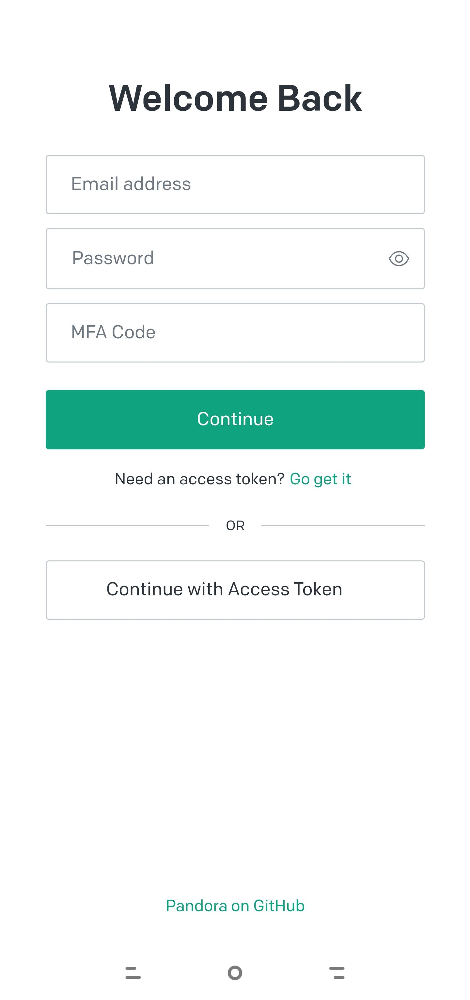
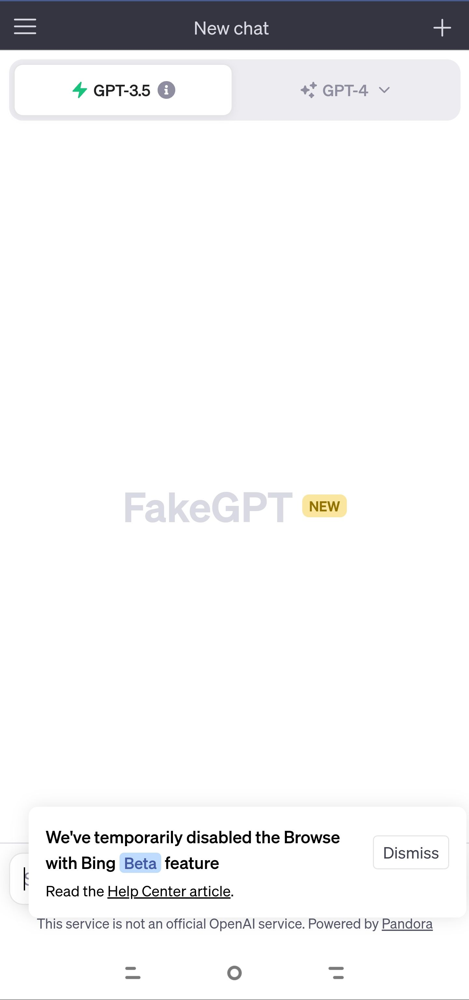

# chatgpt-mirror
#### 丨简介

使用webview访问 [pandora,一个让你呼吸顺畅的ChatGPT](https://github.com/pengzhile/pandora) 的镜像地址。

页面显示的内容和样式由pandora决定，相当于APP内嵌了一个浏览器，对pandora的镜像地址进行访问。如果有问题非APP的自身的原因请移步pandora仓库的issue。

#### 丨安装

页面右侧Releases中下载最新apk文件。

#### 丨权限

1.网络访问权限

用于访问应用内pandora镜像地址内容。

2.读取手机存储

用于Code Interpreter的聊天框中选择文件上传。

#### 丨运行效果

<table><tr><td></td><td></td></tr></table>

